<a href="https://github.com/SaicharanKandukuri/Anime-gif-ReadMe">

  

</a>

<a href="https://wakatime.com/@4da1d8cc-2bc6-4e31-a253-9f0f04e754be">

<strong>Total Code time (~approx) </strong>: 

</a>

<strong>⏺️ Live now:</strong>

  

Hi, My name is Saicharan. I am a ( hire me for money, Ill replace this ) . My developer tag is zman/zman1x1.
[💗 Buy me something ](https://github.com/sponsors/SaicharanKandukuri?o=esb)

<!-- add more on discord SaicharanKandukuri#3741 👌-->

</a>

